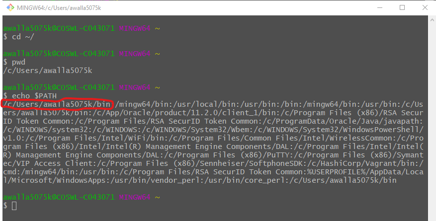

## DevWA.bsh Usage and Installation

### Overview
This script is intended for all DevOps team change contributors. It supports the incorporation of any change from any contributor at any time. It helps establish a Change Cadence for managing All change by the DevOps team.

Working (production ready) change sets are maintained in the Github repositories. Emerging (developing) change sets are maintained in individual change contributor forked copies.

### Usage
This script sets up a workarea on a workstation based on a git repository. The workstation repository is created from a Github forked repository. The latest approved baselines are represented with branches in the workstation repository that point to the cooresponding branches in the main repository the GHE forked repository was copied from.

The workstation workarea repository setup by this script contains the latest approved baselines and release sets at the time of execution. These are established from the main repository the forked repository was copied from.

The main repository the forked repository is copied from contains the latest approved baselines and release sets. These baselines and release sets are validated and approved with DevOps Continuous Integration (CI) and Continuous Deployment (CD) coordination.

This script creates a feature branch for developers to create change in. It is named with the basis it is created from and the JIRA issue number the developer is working on.

For more details on how this script is used refer to the [README.md for this repository](https://github.com/cmguy/DevOps-git/tree/master), **Product Change** section.

### Installation
It is assumed that you have addressed all of the following dependencies prior to running this script:

:point_right: ***Dependencies***
> 1. Execute [Git Installation Procedure](https://github.com/cmguy/DevOps-git/GitInstallationProcedure.adoc.html)
>    1. Working ~/ home directory
>    1. Environment path contains ~/bin directory
>    1. Verify ~/.ssh is configured correctly

#### Verify Dependencies

##### Dependencies 1.i and 1.ii

##### Dependency 1.iii

#### Install and Configure
>    1. copy DevWA.bsh script to ~/bin on your workstation and configure

>    2. Edit ~/bin/DevWA.bsh:
>       - Set TargetDir to workareas directory on workstation
>       - Set GHEUserID to your GHE userid

##### Execute Instructions

>    3. Run DevWA.bsh -h for execute instructions

#### Argument Adjustments

This script is coded to support change contributors contributing change from various Github userids or organizations. 

If there are arguments consistent for your individual usage of this script you can adjust the argument list.
following is an example of how you can set and remove the TargetOrg and RepoFlag from the argument list:

