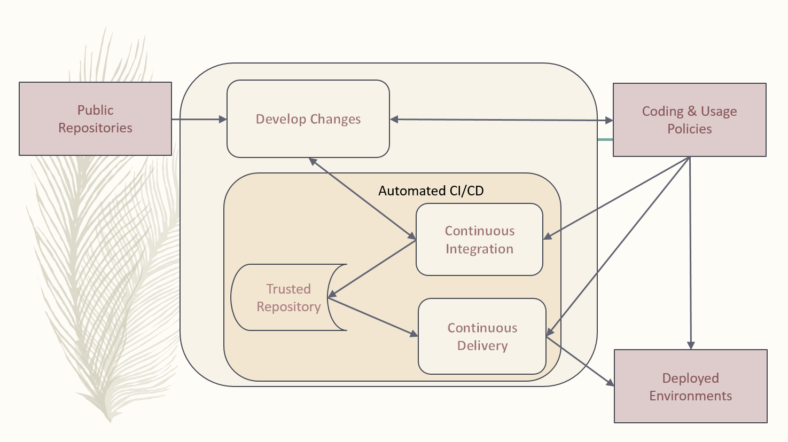
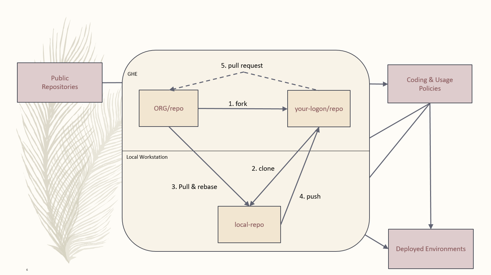

:toc2:

= DevOps Process

== Overview

.The primary objective of DevOps is to appreciate and colaborate on the opposing goals of the development and operations organizations.
. Development is continuously exploring bleeding edge options and delivering leading edge solutions based on them.
. Operations is all about environments that are stable, secure, and Legal.

Together, DevOps teams focus on continuous changes for automation, security, and legality using Continuous (CI) Integration and Continuous Delivery (CD) methodologies to promote release stability.

When developers are focused on operations, they are promoting stability in the Production release environment.

This process is focused on https://www.webopedia.com/TERM/D/devops_development_operations.html[DevOps]  utilizing the https://gist.github.com/Chaser324/ce0505fbed06b947d962[GitFork Workflow]. The Github https://github.com/OpenSrcCM[OpenSrcCM] organization repositories are configured to promote this workflow.

[IMPORTANT]
====
* Spend some time on the above GitFork Workflow link. It's well worth a 5 minute read.
** Look at the comments after the article.  They provide more "real life" insight.
* The GitFork workflow is nothing more than cloning a copy of a given repo on the server-side of a given https://www.saintsjd.com/2011/01/what-is-a-bare-git-repository/index.html[git bare repository] system like, GitHub, GitLabs, or BitBucket. It gets copied to your account on the system.
* You can also share repositories on your workstation with other developers.
** Checkout https://git-scm.com/book/en/v2/Git-Basics-Working-with-Remotes[Working with Remotes]
* If you are considering "Rebasing" it's highly recommended you review https://www.atlassian.com/git/tutorials/merging-vs-rebasing#the-golden-rule-of-rebasing[The Golden Rule of Rebasing].
====

.*The gateway to operational stability includes the DevOps teams support of:*
* Continuous Integration(https://en.wikipedia.org/wiki/Continuous_integration[CI]),
* Continuous Delivery (https://en.wikipedia.org/wiki/Continuous_delivery[CD]), and
* Operational tools automation and documentation

The Github organizations identify contributors providing them *read access* to the official trusted repositories. Teams are associated with Github organizations to promote code reviews based on pull requests from matching forked repos.

This ensures stable, production release ready code is maintained in Github organizational repos separately from DevOps analyst forked repos containing change that is developing.

.*The purpose of this process is to identify an environment that:*
. Separates _**Development tasks**_ from _**Operation tasks**_ and _**working deliverables**_ from _**developing deliverables**_
. Promotes development that encompasses the following from the start of a change:
.. User requirements for upcoming releases
.. Security
.. Testing automation
.. CI/CD automation
.. License and dependency tracking
. Production Release issues are considered for the current and following CI/CD cycles
. Promotes more passive programming, less active programming, and more stability in https://www.webopedia.com/TERM/I/IT.html[IT] operations
.. See Reference section link *_On Modern Software Development_* - (5 minute read)
. Promotes CI/CD automation

.**The goals of this process include:**
* Get more value to the market quicker
* Reduce risk by addressing security from the start
* Empower developers with ability to consider and present all possibilities
* Promote an environment where developers can support any group within or outside the organization
* Identify, develop, and maintain “Best Practices”

.**The https://www.atlassian.com/git/tutorials/comparing-workflows/forking-workflow[GitFork Workflow], is built on and assumes the https://www.atlassian.com/git/tutorials/comparing-workflows/gitflow-workflow[GitFlow workflow]. The focus is to:**
. Promote developer contributions to other Github organizations
. Minumize the number of deployment bases to working Production and Latest working Development
. Promote code reviews on all contributions and changes to official repositories where:
.. Exiting solutions, both on premise and off premise, are considered prior to creating new solutions.
.. Coding & Usage Policies are addressed prior to change additions to official trusted repositories. These policies address:
... Security
... Licensing
... Testing for all known functionality and dependencies
... Existing Coding Standards
. Provide Github repository backups for contributor workstation repositories
. Provide the capability for each developer to consider changes and testing for:
.. Client or user "asks"
.. CI/CD automation
.. All current and newly developed testing
. Provide a safe Github repository environment for new-contributors to experiment with as they begin to use the automated CI/CD for the given Github organization.

[IMPORTANT]
====
* The above GitFlow Workflow link points Atlassian's site.
* Consider Bitbucket like you would GitHub or GitLabs.

====

== DevOps Process

The following image depicts the context and high-level components of this process.

The following sections explain each high-level component providing links that cover more detail supporting the component.

Steps specific to Forking are also covered.

=== Develop Changes

.The primary steps for developing changes in a DevOps culture:
. *Establish working environment*
.. The https://github.com/cmguy/DevOps-git/blob/master/app/developer-workarea/DevWA.bsh[DevWA.bsh] script was designed for this step
... Basis of feature branch is clearly identified in feature branch name
... Refer to script preamble for configuration and setup details
. *Make changes*
.. All changes are accompanied by _**development of**_ and _**exercising all known testing**_
.. Prior to push of any feature branch with changes to origin repo:
... All shared branches from the *main organization repository* are:
.... pulled to local repo - _**(includes master, develop, and all current release branches)**_
.... merged with feature branch containing new changes
..... This can be _**merged to**_ or _**merged from**_ depending on current deployment circumstances
.... verified with all known testing per DevOps leadership
. *Push locally committed feature branch to origin (forked) repo*

[IMPORTANT]
====
.NOTES:
. The above steps:
.. Are repeated until the feature branch with changes is stable with all shared branches on developer, local workstation, cloned repo.
.. Assumes the https://www.atlassian.com/git/tutorials/comparing-workflows/forking-workflow[GitFork Workflow] is being followed.
. DevOps leadership need working feature branches that can be merged and combined on demand per deployment needs for upcoming releases. *This depends greatly on Note 1.a above.*
. Developers should maintain their feature branches until they are merged to DevOps leadership maintained master branches.
. Developers are focused on development separately from Operations when they are not scheduled for operational support.
. Reference [Modern Development Process]

====

.https://en.wikipedia.org/wiki/Continuous_integration[CI] / https://en.wikipedia.org/wiki/Continuous_delivery[CD] automation along with developer identified opportunities, when scheduled for operational support, is the gateway to Operations stability providing:
* Details to Operations of coming changes
* Full deployment testing prior to production releases
* Ability to change and test CI/CD automation
* Ability to identify and develop for needed operational improvements

Developers work directly with *public* and *local* repositories identifying best options for development requirements or “asks”.

During this DevOps process, development references and challenges *Coding & Usage Policies* per security, licensing, testing, and coding standards.

Development proceeds unencumbered with private, individual developer controlled forked repos.

[NOTE]
====
.NOTE:
The *_Fork Related Steps_* image below is a https://en.wikipedia.org/wiki/Decomposition_(computer_science)#Decomposition_diagram[decomposition diagram] of the *_Develop Changes_* process.
====

Developers are free and encouraged to expand and improve CI/CD automation. This includes building, testing, and operational environment challenges as they identify and develop new functionality for customer solutions.

*_Code Reviews_* occur with Development Leads prior to initiating the *_Automated CI/CD_*.

*Deployed Environments* are non-development environments like UAT or Production. They are focused on validation and automated testing updates. They are the primary focus of the develop and master branches of official trusted repositories.

[IMPORTANT]
====
.NOTES:
* For the https://www.atlassian.com/git/tutorials/comparing-workflows/forking-workflow[GitFork workflow] __per Atlassian link__, All development changes (Dev coding, testing, verifying, etc) happen prior to step 7.
* *Rebuild project/repository OFTEN. All repos including workareas are:*
** less stale
** Up to date
** More secure
* Github repos used by automated *_Continuous Integration_* are configured to promote code reviews and clean development baseline starting points. These are the repositories developers fork and clone from to create local workstation repository work areas.
* Developer local repos can utilize CI and CD together to promote to a developer controlled environment. These type of snapshot pipelines are limited to 5 versions in the *_Trusted Repository_*.
====

=== Continuous Itegration

An automated process that should be initiated at the completion of a *_git push_* to the primary (non-forked) Github organization repository *_develop_* branch.

The build of this process enforces and verifies the *_Coding & Usage Policies_*.

.Provides tested deployment sets to the *_Trusted Repository_*:
* All code compiling and known tests are executed for every build prior to adding to **_Trusted Repository_**.
* This allows deployment environments, promoted to by *_Continuous Delivery_* to be focused on validation of new changes.
* Successful builds identified with https://semver.org/[semantic versioning].
* Un-Successful, non-development builds are reported on for a "churn" metric. Development environment "builds" supporting the *_Develop Changes_* process are not included in this metric.

[NOTE]
====
.NOTE:
* Changes to this process are developed and tested in the *_Develop Changes_* process, subject to code reviews.
====

=== Trusted Repository

This is the end point of the *_Continuous Integration_* process and the starting point of the *_Continuous Delivery_* process.

In addition to updates made by the *_Continuous Integration_* process, *Coding & Usage Policies* can report on and remove elements as required.

=== Continuous Delivery

Provides deployments from the *_Trusted Repository_* for requested environments.

*Coding & Usage Policies* are used to report on and remove elements as required within this process.

=== Fork Related Steps

The steps related to forking are initiated by the developer. Steps 1 through 4 are completed by the developer where step 5 is completed by the leadership of the repository.

[NOTE]
====
.NOTES:
. The initial forking steps are automated by the [DevWA.bsh] script.
. The location of the https://mijingo.com/blog/what-is-a-bare-git-repository[git bare repositories] are at Github organization and the forked developer GitHub repository. 
====

This image is a https://en.wikipedia.org/wiki/Decomposition_(computer_science)#Decomposition_diagram[process decomposition] of the *_Develop Changes_* process in the previous diagram. It is not complete as it is focused on the "fork steps" level.

[NOTE]
====
.NOTES:
. Developers may have multiple instances of the above development environment depending on the projects/repos they support.
. Code reviews initiated by contributing developers and managed by DevLeads are the gateway to controlled Github organization repository updates and non-development CI initiation. 
. The use of forked repos only requires ready-only permission for contributing developers.
.. Executing the [Git Installation Procedure] is required for this.
. This images occurs in the *_Develop Changes_* process of the previous image. It is separate from:
.. Automation:
... CI
... CD
.. Operations
. From the contributing developer point of view, a *_pull request_* is an "ask" to the repository team to pull prepared contributions
====

== References

* https://reflectoring.io/github-fork-and-pull/[Fork & Pull Workflow] For git beginners
* https://guides.github.com/activities/forking/[Forking Projects] – example using the https://github.com/octocat/Spoon-Knife[spoon-knife project]
* https://www.youtube.com/playlist?list=PL0lo9MOBetEHhfG9vJzVCTiDYcbhAiEqL[GitHub and Git Foundations (YouTube)]
* https://www.infoworld.com/article/3230905/application-development/what-a-modern-development-organization-looks-like.html[What a modern development organization looks like]
* https://www.rainerhahnekamp.com/en/modern-software-development/[On Modern Software Development]
* [Modern Development Process (MDP)]
