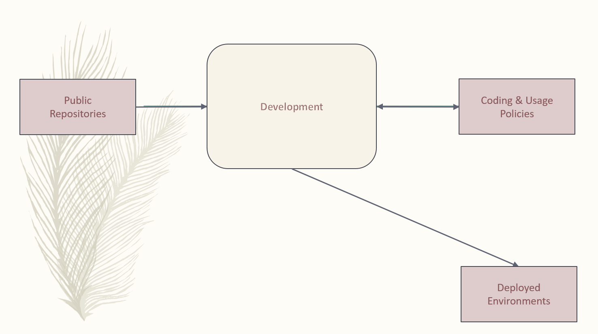
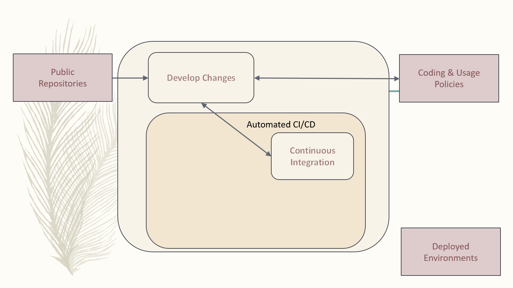
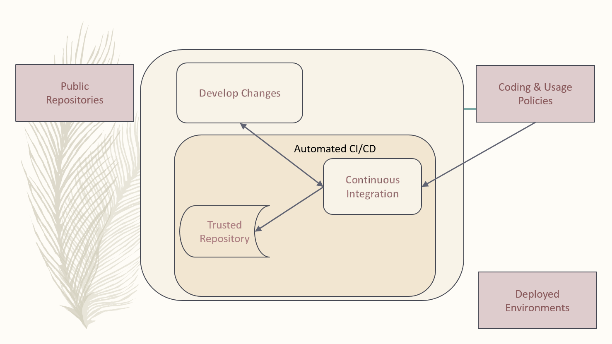
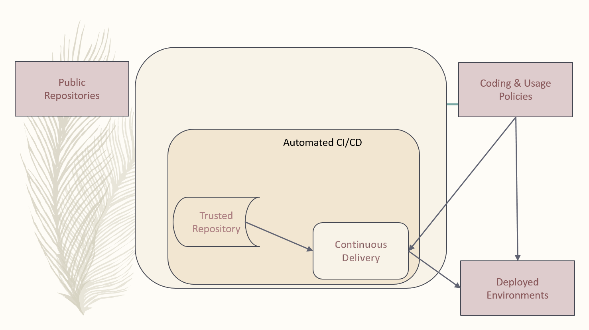

:toc2:

= Modern Development Process

== Overview

The Modern Development Process (MDP) is a https://en.wikipedia.org/wiki/Software_development_process[Software Development Process] captured from historical industry practices and evolving modern approaches.  It's maintained as change is encountered and experienced in the IT industry.

https://aws.amazon.com/devops/what-is-devops/[DevOps] is a concept that drives this MDP. The guiding principles of DevOps include culture, measurement, automation and sharing. DevOps is considered to be a new approach to the more traditional Application Lifecycle Management (ALM) process.

The concept of Application Program Interfaces (APIs) is a major driver as Legacy decomposition and rebuilding efforts are applied and managed. A good introduction to APIs is the https://www.youtube.com/watch?v=cpRcK4GS068&list=PLcgRuP1JhcBP8Kh0MC53GH_pxqfOhTVLa[API 101] course by https://www.programmableweb.com/[ProgrammableWeb]. The https://api-university.com/[API-University] is a good primary reference.

.The two major sections to this document are DevOps and API Concepts. They are presented at a high level to:
* Identify consistent major points of understanding
* Enable and encourage more efficient collaboration on the topics

[IMPORTANT]
====
.Good "set the stage" references:
* https://www.infoworld.com/article/3230905/application-development/what-a-modern-development-organization-looks-like.html[What a modern development organization looks like]
* https://www.rainerhahnekamp.com/en/modern-software-development/[On Modern Software Development]

====

[NOTE]
====
.Notes:
. The first reference covers the *__current state of many organizations concepts and tool sets__*. (5 minute read)
. The second reference reviews *past and current approaches* of **__A Software Developers Job Description__**. (5 minute read)
. These references set the stage for this MDP document.
====

.The purpose of the MDP is to encourage and support developers by:
* Separating Development from Operations
* Identifying Automation separately from Development and Operations
* Improving collaboration between development and IT operations
* Encourage an MDP approach; more passive programming, less active programming, more stability in https://www.webopedia.com/TERM/I/IT.html[IT] operations

.The goals of this process include:
* Get more value to the market quicker
* Reduce risk by addressing security from the start
* Empower developers with ability to consider and present all possibilities
* Promote an environment where developers can support any group within or outside the organization
* Identify, develop, and maintain “Best Practices”

The primary workflow utilized by the MDP is the https://datasift.github.io/gitflow/IntroducingGitFlow.html[GitFlow Workflow].

.The https://www.atlassian.com/git/tutorials/comparing-workflows/forking-workflow[GitFork Workflow], which is built on the GitFlow workflow, is an additional development tool to:
. Promote developer contributions to outside open source projects or internal "other organization" projects
. Provide a backup capability to the contributor workstations
. Provides a safe environment for new-contributors to experiment with before acquiring "solution/code review" access
. Promoted by default configurations for GitHub and GitLab, primary examples of git bare repository management tools. 

[NOTE]
====
* This approach has been defined and exercised in the open source development world.
====

== DevOps Concept

In this section a high level view DevOps topics is presented. The intent is to support consistency in collaboration concerning DevOps.

=== Context Diagram

==== Develop Changes

Developers are focused on development separately from Operations and https://en.wikipedia.org/wiki/Continuous_integration[CI] / https://en.wikipedia.org/wiki/Continuous_delivery[CD] automation. They work directly with *public repositories* and local code identifying best options for development requirements or “asks”.

During this DevOps process, development references and challenges *Coding & Usage Policies* per security, licensing, testing, and coding standards.

Development proceeds unencumbered with private, individual developer controlled forked repositories, separate from the automation of CI/CD and stability required for operations.

Developers are free and encouraged to expand and improve CI/CD automation. This includes building, testing, and operational environment challenges as they develop new functionality for customer solutions.

*_Code Reviews_* occur with Development Leads prior to initiating the Automated CI/CD.

=== DevOps Process
image::images/devops-process.png[]

[NOTE]
====
.NOTES:
* For the https://www.atlassian.com/git/tutorials/comparing-workflows/forking-workflow[GitFork workflow], Dev coding, testing, verifying, etc, happens between step 7 and 8.
* *Rebuild project/repository OFTEN. All repos including workareas are:*
** less stale
** Up to date
** More secure
* Project or repositories that are used by automated *_Continuous Integration_* are configured to promote code reviews and clean development baseline starting points. These are the repositories developers fork from.
* Developer local (workstation) repos can utilize CI and CD together to promote to a developer controlled environment. These type of pipelines are limited to a maximum set of versions in the *__Trusted Repository__* as they support development. Otherwise non-development pipelines end at the *__Trusted Repository__*.
====

==== Continuous Itegration

An automated process that is initiated at the completion of a *_git push_* to the primary (non-forked) Github repository *_develop_* branch.

The build of this process enforces and verifys the *_Coding & Usage Policies_*.

.Provides tested deployment sets to the *_Trusted Repository_*:
* All assembly, code building, and know tests, are executed for every build prior to adding to Trusted Repo.
* 
* Successful build identified with https://semver.org/[semantic versioning].
* Unsuccessful build is reported back to the submitter

[NOTE]
====
.NOTES:
. Input changes to this process are developed and tested in the *_Develop Changes_* process, subject to code reviews.
. For the GitFork workflow a pull request initiates this
. For the GitFlow workflow, a feature branch push initiates this
. This allows deployment environments, promoted to by *_Continuous Deliver_* to be focused on validation of new changes.
====

==== Trusted Repository

This is the end point of the *_Continuous Integration_* process and the starting point of the *_Continuous Delivery_* process.

In addition to updates made by the *_Continuous Integration_* process, *_Coding & Usage Policies_* can report on and remove elements as required.

==== Continuous Delivery

Provides deployments from the *_Trusted Repository_* for argument selected environments.

*_Coding & Usage Policies_* can report on and remove elements as required within this process.

[NOTE]
====
.NOTE:
* *_Coding & Usage Policies_* can report on and remove elements as required outside of the MDP DevOps Process.
====

=== DevOps Developer

.For given “asks”, developer looks for and/or develops working solutions
* Identify/Establish repository or repo:
** From Public Repository or Team Repository or create new (Team repos available to CI process)
* For GitFork workflow:
** Fork from existing projects or repositories for development access to outside or "other group" repositories: (See reference section for related links)
** Forking Projects – (example using the spoon-knife project),
** Fork & Pull Workflow (For git beginners) 
** Clone from forked repo
** Create additional remote to non-forked repo
** All contributions are done with "Pull requests" using feature branches
** Automation starts when devlead completes the code review and pushes to non-forked repo development branch.

** NOTE: Rebuild local repo often, daily to start
* Verify Coding & Usage Policies:
** Report variance to customers
** Challenge security, licensing, testing, and coding standards as needed
* Prepare Changes:
** Test with all known CI process testing.  Add, modify, remove as needed.
* Commit and merge per GitFork workflow (Dev coding, testing, verifying, etc, happens between step 7 and 8)
* Initiate automated CI
** Push Changes to Non-Forked repository or project

=== Continuous Integration Automated Process

.The Continuous Integration process is:
* Initiated by Developer with a repository branch push
* Automatically verified with existing “Coding & Usage Policies”
* Automatic Build
* Automatic Testing
* Build/Test reporting to development
* Successful build identified with https://semver.org/[semantic versioning]
* Successful build delivered to Trusted Repository

[NOTE]
====
.NOTE:
*_Coding & Usage Policies_* verification reporting is run against all elements in Trusted Repository on a regular basis.
====

=== Continuous Delivery Automated Process

.The Continuous Delivery process:
* Starts with up-to-date, verified, built from a Trusted Repository 
* Contents included are delivered from CI automated process exclusively
* Uses Builds identified with https://semver.org/[semantic versioning]
* Automatically verified with existing “Coding & Usage Policies”
* Automatic environment deployment report
* Automatically deploys to specified environment

[NOTE]
====
.NOTE:
*_Coding & Usage Policies_* verification reporting is run against all "deployed to" environments on a regular basis.
====

=== GitFork Related Steps

The GitFork workflow is an additional tool available to development when needed for the reasons mentioned in the Overview section. This tool can be engaged from the system used to manage http://www.saintsjd.com/2011/01/what-is-a-bare-git-repository/[git bare repos].

The following image identifies the steps specific to the GitFork workflow.

image::images/Development-WorkArea.png[]

[IMPORTANT]
====
.Important:
* Just like the GitFlow workflow, the ORG/repo is the starting point of automated Continuous Integration. For the GitFlow workflow, the feature branch is the delivery element.
* Code reviews are initiated by contributing developers when they initiate "pull requests". These are managed by DevLeads. These are the gateway to controlled GitHub repository updates and non-development CI initiation. 
* ORG/repos are readable to contributing developers.
** Executing the https://github.com/cmguy/CM-Plan-Site/blob/develop/app/site/git/GitInstallationProcedure.adoc[Install git] procedure is required for this.
* The Develop Changes process is separate from:
** Automation:
*** CI
*** CD
** Operations
====

== API Concept

**_This section under construction._**

Reference: https://blog.apisyouwonthate.com/understanding-rpc-rest-and-graphql-2f959aadebe7[Understanding RPC, Rest, and GraphQL]

=== Styles
* Restful
** Uses HTTP requests to GET, PUT, POST and DELETE data.
** Basic Structure of Restful APIs:
*** Endpoint: https://api.stripe.com
*** Endpoint with version: https://api.stripe.com/v1
*** Resources:
**** https//api.stripe.com/v1/balance
**** https//api.stripe.com/v1/balance/history
**** https//api.stripe.com/v1/charges
**** https//api.stripe.com/v1/charges/{CHARGE_ID}
**** https//api.stripe.com/v1/customers
* Streaming
** Streaming API enables streaming of events using push technology and provides a subscription mechanism for receiving events in near real time. The Streaming API subscription mechanism supports multiple types of events, including PushTopic events, generic events, platform events, and Change Data Capture events.
* Browser
** https://frontendmasters.com/books/front-end-handbook/2018/learning/web-api.html[Learn Web Browser APIs]
* RPC
* Native
* Indirect
* GraphQL

=== Types
* Internet
* Browser
* Product
* Standard Spec
* System Embedded

==== What is Purpose / Service?

==== API Main Components
* Act as the messenger
* Collect and process data
* Return the response of the request

Phases of the API Management Lifecycle (in no particular order).

* Planning and Analysis
* Design
* Development
* Operation
* Governance
* Measurement and Testing
* Engagement
* Versioning and Retirement

Stakeholder Roles:

* API Owner
* IT Architect
* API Developer
* Chief Security Officer
* Service Owner
* Service Operator
* API Evangelist
* API Consumer
* NOTE: These are roles, not necessarily job descriptions

== References

* https://reflectoring.io/github-fork-and-pull/[Fork & Pull Workflow] For git beginners
* https://guides.github.com/activities/forking/[Forking Projects] – example using the https://github.com/octocat/Spoon-Knife[spoon-knife project]
* https://www.youtube.com/playlist?list=PL0lo9MOBetEHhfG9vJzVCTiDYcbhAiEqL[GitHub and Git Foundations (YouTube)]
* https://usersnap.com/blog/gitlab-github/[GitHub vrs GitLab]

.Good "DevOps" references:
* https://www.webopedia.com/TERM/D/devops_development_operations.html[Webopedia DevOps]
* https://en.wikipedia.org/wiki/DevOps[Wikipedia DevOps]
* https://aws.amazon.com/devops/what-is-devops/[AWS DevOps]